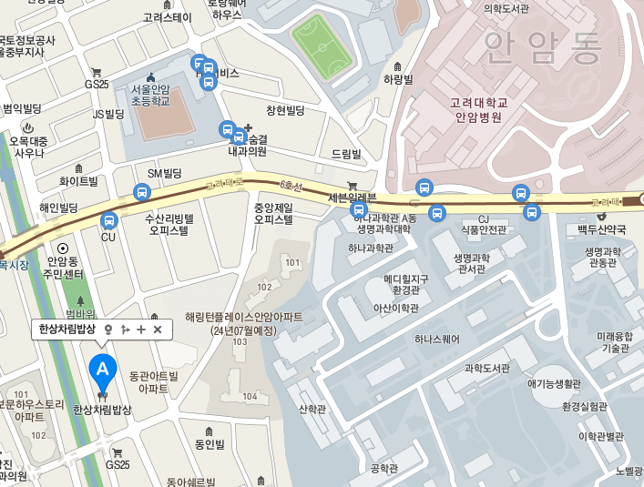

# 자기소개
## 누구인가
물리학과 19학번 하윤수
> 예쁜 자소서 쓰는 법을 모르겠다. 인생을 낭비했다.
> -하윤수-

## 무엇을 하고 싶은가
1. 내 힘으로 서비스 구축이 가능하도록 공부
    1. 프로그래밍
    2. 그 외 필요한 모든 지식들까지
2. 뛰어난 사람들을 많이 만나며 자극받기
3. 기억에 남을만한 성과를 만들고 나가기

## 무엇을 좋아하는가
+ 곱창 -> 자주 가던 곳이 맛이 없어져서 안찾아감
+ 보쌈: 안암한상차림
---

---

## 더 할말이 있는가
### 할말
없다

### 링크를 넣어봤는가
[구-글](https://www.google.com)

### 다른 지원서를 읽어봤는가
위압감을 느꼈고 앞으로 열심히 살아야겠다는 생각을 했다.